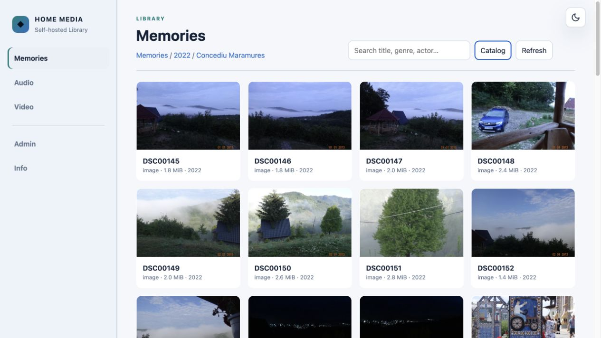
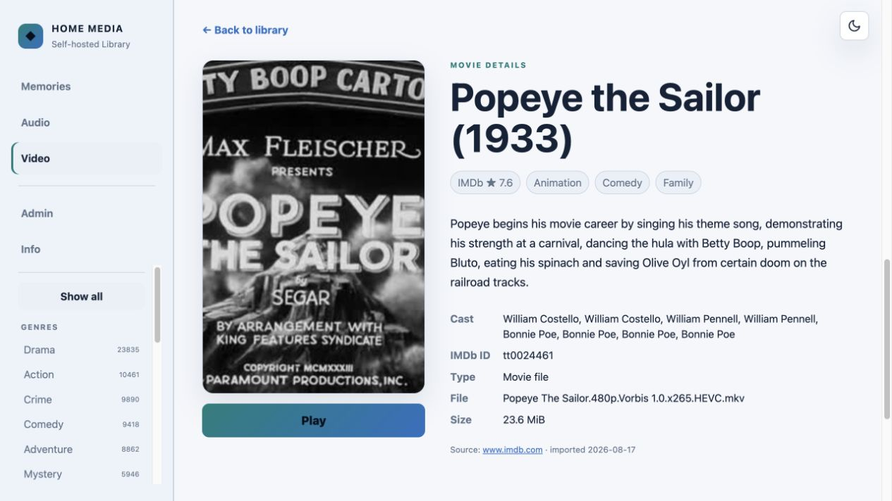

# Home Media Center

> **Work in progress, built for personal use.** This is a self-hosted tool built
> around one particular media collection and home-lab. It is public because the
> approach may be useful to someone; it is not a product and comes without a
> promise that every environment will work unchanged.

**This was written with an AI agent, and it is meant to be read the same way.**
Treat it as a starting point rather than a universal installer. Your storage,
hardware acceleration, mount layout and playback needs will differ. Point your
own agent at this repository and have it adapt the code and deployment templates
to what you have. That is usually faster and safer than copying this deployment
verbatim, and it is how the code got here.

Home Media Center provides browser-based management and playback for a
self-hosted media disk.

The application exposes read-only media libraries and a separate guarded
administrator. Destructive actions require explicit confirmation. The
SQLite catalog and derived metadata use persistent application storage while
the original media remains on separately mounted source storage.

Movie and episode matching, ratings, genres and cast use IMDb identifiers and contributor datasets. Imported synopses are stored in the local catalog together with their source URL and retrieval date, so normal browsing does not depend on an external service.

## Screenshots

### Mixed photo and video memories



### Locally stored synopsis and playback



## What it provides

- folder and catalog views for mixed photo/video memories;
- persistent light/dark appearance with a system-theme default;
- a resizable, persistent navigation sidebar with media-specific filters;
- direct HTML5 playback for audio and mixed photo/video collections with byte-range support;
- Jellyfin HLS playback for the video library, with H.264/AAC stream copy when possible;
- optional AMD hardware transcoding through VA-API for incompatible video codecs;
- independent playback sessions for multiple simultaneous home users;
- photo previews plus previous/next navigation;
- title, genre and actor search without a separate actor-grouping view;
- photo filtering by year, audio filtering by genre and year, and video filtering by genre and decade;
- local audio tag indexing for genre, year and artist, with conservative folder/date fallbacks;
- movie, series and episode detail pages with ratings, cast and locally stored synopses;
- stable `SxxExx` episode labels kept separate from canonical searchable titles;
- live disk capacity, temperature and essential SMART indicators;
- complete Admin file management: create folders, direct-to-storage uploads, rename, move and confirmed delete;
- local catalog editing for title, year, IMDb ID/rating, genres, cast and synopsis;
- automatic targeted Media Center/Jellyfin refreshes after file changes, plus a manual full refresh;
- background rescans and IMDb metadata refreshes.

## Playback pipeline

The browser never asks Jellyfin to search for a filename at playback time. The
local catalog stores a persistent `jellyfin_item_id` and
`jellyfin_media_source_id` for every matched video. A playback request resolves
those IDs in SQLite and opens the corresponding Jellyfin HLS manifest directly.
This avoids ambiguous matches when separate folders contain files with the same
name.

Every playback request receives its own Jellyfin device ID and play-session ID,
so viewers can play, pause and seek independently. There is no application-level
single-viewer lock. Multiple users can therefore stream at the same time on a
home network; the practical limit depends on disk throughput, network capacity
and, most importantly, how many streams require transcoding simultaneously.

For browser-friendly H.264 video and AAC audio, Jellyfin can copy compatible
streams into HLS without re-encoding them. This uses comparatively little CPU or
GPU and makes several concurrent streams inexpensive. Incompatible codecs are
converted to H.264/AAC, optionally through VA-API. Each active transcode consumes
hardware capacity and its own temporary segment window, so installations should
be sized and tested for their intended number of concurrent 1080p streams.

## Bounded HLS sliding window

Transcoding does not need to retain a complete converted movie. The supplied
configuration helper enables Jellyfin throttling and automatic segment deletion:

- transcoding slows down after it has built a useful lead over the viewer;
- consumed HLS segments are deleted while playback continues;
- only the active data plus a configurable recent window remains in the
  transcode directory;
- interrupted or completed sessions do not become permanent media copies.

The defaults in `scripts/configure_jellyfin_transcoding.py` use a 60-second
throttle delay and retain 300 seconds of old segments. They are deployment
defaults, not universal recommendations. The transcode directory may be placed
on a bounded RAM-backed filesystem to reduce latency and avoid unnecessary SSD
writes. Persistent data — the SQLite catalogs, metadata and artwork — remains on
persistent storage.

## Index updates

Media Center and Jellyfin keep separate catalogs, and Jellyfin remains the only
writer of its own database. The application synchronizes them without modifying
Jellyfin's tables:

1. Media Center scans filesystem metadata into its local SQLite catalog.
2. A full physical path is used once to join each local video to Jellyfin's
   logical item and physical media-source IDs.
3. Normal playback subsequently uses only those persistent IDs.
4. Admin add, rename, move and delete operations coalesce into one background
   job instead of launching overlapping scans.
5. Video changes request a targeted refresh of the closest known Jellyfin item,
   then reconcile IDs repeatedly while Jellyfin's asynchronous scan completes.
6. **Refresh indexes** requests a full Jellyfin library refresh and a complete
   local rescan when a broader rebuild is wanted.

`POST /api/jobs/jellyfin-sync` can rebuild only the persistent ID mapping from a
read-only connection to Jellyfin's catalog. Targeted updates keep routine file
management quick, while the full refresh remains available for recovery or
out-of-band filesystem changes.

## Trust boundaries

The web application can run in an unprivileged Linux container. Media source
mounts are read-only. A small root-owned helper on the host accepts only the
explicit file operations used by Admin: create directory, streamed upload,
rename, move and confirmed delete. It rejects absolute paths, traversal,
library-root deletion/rename/move and unsupported actions. It never executes
shell commands. Uploads are written directly to a hidden temporary file on the
media storage, fsynced and atomically exposed under their final name; interrupted
uploads are removed.

SMART data is published by a separate host timer. Both host bridges are exposed
read-only to the container from `/var/lib/media-center-bridge`.

## Example runtime layout

- application: `/opt/media-center` in a Linux container;
- state/catalog: `/var/lib/media-center` in the container;
- thumbnail and IMDb cache: `/var/cache/media-center`;
- Jellyfin state and transcode cache: `/var/lib/jellyfin` and `/var/cache/jellyfin`;
- read-only media sources in the container: `/srv/media/readonly/<library-name>`;
- application HTTP service: port `9080`;
- Jellyfin playback service: port `8096`, with a restricted playback-only account;
- process supervision: `media-center.service` and `jellyfin.service`.

Only the selected render device should be passed into the application
container. The reference deployment configures Jellyfin exclusively for VA-API;
adjust the templates for the available hardware. The application reads its private Jellyfin connection values
from `/etc/media-center/jellyfin.env` through the systemd drop-in
`deploy/media-center-jellyfin.conf`.

Video playback uses a persistent mapping in `catalog.sqlite3`: each local
relative file path is joined once against Jellyfin's full physical path and
stores both `jellyfin_item_id` and `jellyfin_media_source_id`. Playback then
uses those IDs directly; it does not search by filename or traverse Jellyfin's
logical series/folder hierarchy. `POST /api/jobs/jellyfin-sync` rebuilds the
mapping in bulk from Jellyfin's persistent catalog at
`/var/lib/jellyfin/data/jellyfin.db`, opened read-only. Jellyfin remains the
only writer of its catalog and all playback requests still go through its API.
Admin file changes request a targeted Jellyfin refresh using the existing
administrative credential and reconcile persistent playback IDs repeatedly as
the asynchronous scan finishes. The manual **Refresh indexes** action requests
a full Jellyfin scan and a complete local catalog scan.

## Admin

The Admin view browses the writable media tree without exposing that writable
mount to the web process. **New folder** creates a directory in the current
location. **Upload files** supports multiple files and shows per-file progress;
the browser request is streamed through the Unix socket bridge instead of being
buffered on container storage. **Manage** provides rename, move, local metadata
editing and permanent deletion. Delete uses a confirmation dialog whose default
action is **Cancel**; the server still validates the exact target name supplied
by the interface.

Renaming or moving an indexed item also relocates its existing local catalog
record and descendants, preserving manually curated metadata. Filesystem
changes are followed by a coalesced background catalog update. Video changes
additionally refresh the closest known Jellyfin catalog node and reconcile
Jellyfin item/media-source IDs in several passes.

The reference deployment places Jellyfin's transcode directory on a bounded
RAM-backed filesystem. Size it for the expected concurrent streams and available
memory. HLS throttling and segment deletion keep only a bounded sliding window;
persistent catalog and artwork remain on persistent storage.

Public repository rules are recorded in `AGENTS.md`. Installation-specific
deployment and verification details belong in the optional, separately versioned
private operations repository at `.private-ops/`.

## Catalog metadata

The scanner stores searchable metadata in `catalog.sqlite3` and preserves
manually confirmed IMDb and episode matches during later rescans. Photo years
come from year folders when present, then file dates. Audio metadata comes from
embedded tags; missing or placeholder values use conservative library
categories and file/path dates.

One-time maintenance utilities are available for existing installations:

```text
python scripts/migrate_html_details.py DATABASE DETAILS_DIRECTORY
python scripts/enrich_episodes.py
python scripts/enrich_audio.py
```

Episode enrichment matches the parent series first, then the exact
season/episode or unique episode title. Synopsis fallbacks use IMDb, TVMaze and
TheTVDB, and every accepted result retains its source in the database.

## Tests

Run inside the project virtual environment:

```text
pytest -q
```

The suite covers path confinement, scanner/title parsing, IMDb candidate
selection, episode numbering and source parsing, photo/audio metadata, the
restricted host helper and Jellyfin playback selection. Deployment is followed
by live API, filtering, service, metadata and hardware-playback checks in the
target environment.

## IMDb data

Metadata comes from the official IMDb non-commercial datasets at
https://datasets.imdbws.com/. Use is subject to IMDb's dataset terms and
attribution requirements. IMDb and the IMDb logo are trademarks of IMDb.com,
Inc. This project is not affiliated with or endorsed by IMDb.

TVMaze and TheTVDB may be used as one-time synopsis fallbacks for exact episode
matches. Their source page is retained per imported record.
